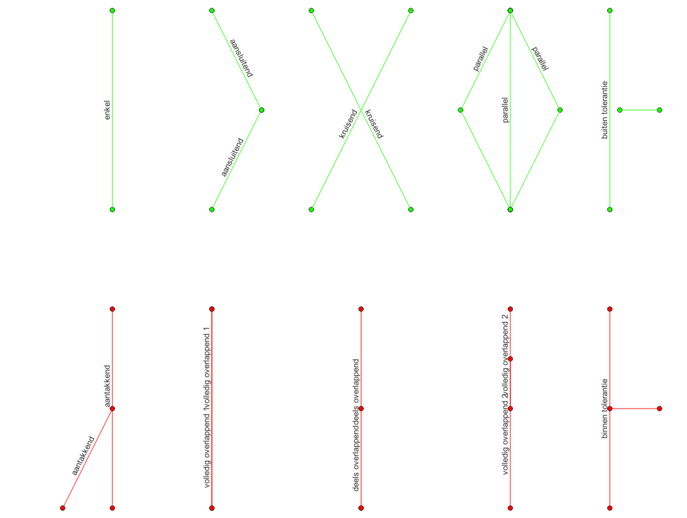

# Functies

De beschijving van functies zijn bijgewerkt tot versie 1.4.0 van de Validatiemodule. Hieronder staan de functies beschreven uitgesplitst naar:

- [Hulpfuncties (general\_rules)](#hulpfuncties-general_rules)
- [Logische functies (validation\_rules, type=logic)](#logische-functies-validation_rules-typelogic)
- [Topologische functies (validation\_rules, type=topologic)](#topologische-functies-validation_rules-typetopologic)

# Hulpfuncties (general\_rules)

Hulpfuncties worden gebruikt als functie in de sectie **general\_rules** van de validatieregels. Hulpfuncties geven altijd een numerieke waarde terug, met uitzondering van de functies *join\_parameter* en *object\_relation*.

|  **Naam**        |  **Invoer**                                                                             |  **Beschrijving**                                                                                                                                                                                                                                                                                                                                                                                                                                                                                                                                                                                                                                                                                                                                                                                                                                                                                                                                                                                                                                                                                                                                                                                                                                                                                                                                                                                                                                                                                                                                                                                                                                                                                                                                                                                                                                                                                                                                                                                                                                                                                                  |
|:-----------------|:----------------------------------------------------------------------------------------|:-------------------------------------------------------------------------------------------------------------------------------------------------------------------------------------------------------------------------------------------------------------------------------------------------------------------------------------------------------------------------------------------------------------------------------------------------------------------------------------------------------------------------------------------------------------------------------------------------------------------------------------------------------------------------------------------------------------------------------------------------------------------------------------------------------------------------------------------------------------------------------------------------------------------------------------------------------------------------------------------------------------------------------------------------------------------------------------------------------------------------------------------------------------------------------------------------------------------------------------------------------------------------------------------------------------------------------------------------------------------------------------------------------------------------------------------------------------------------------------------------------------------------------------------------------------------------------------------------------------------------------------------------------------------------------------------------------------------------------------------------------------------------------------------------------------------------------------------------------------------------------------------------------------------------------------------------------------------------------------------------------------------------------------------------------------------------------------------------------------------|
| buffer           | radius (m)   percentile (0-100)   coverage (AHN)   fill\_value (optioneel)  | Berekent het percentiel (*percentile*) over een raster (*coverage*) binnen een vlak beschreven als een cirkel met een *radius* rondom het object.   Wanneer *fill\_value* wordt gespecificeerd, dan worden ontbrekende waarden uit de functie opgevuld met deze waarde.   In de validatieModule wordt nu het AHN 3 DTM met een celgrootte van 5m gebruikt als coverage.                                                                                                                                                                                                                                                                                                                                                                                                                                                                                                                                                                                                                                                                                                                                                                                                                                                                                                                                                                                                                                                                                                                                                                                                                                                                                                                                                                                                                                                                                                                                                                                                                                                                                                                                    |
| difference       | left   right   absolute (default=False)                                         | Berekent het verschil tussen een linker (*left*) en rechter (*right*), waarbij. Het resultaat = *left - right*   Het is mogelijk het absolute (*absolute*=*True*) te berekenen met het optionele argument *absolute.*   *left* en *right* kunnen een getal of een HyDAMO attribuut zijn.                                                                                                                                                                                                                                                                                                                                                                                                                                                                                                                                                                                                                                                                                                                                                                                                                                                                                                                                                                                                                                                                                                                                                                                                                                                                                                                                                                                                                                                                                                                                                                                                                                                                                                                                                                                                                   |
| divide           | left   right                                                                        | Deelt de linker (*left*) door de rechter (*right*), term. Dus: resultaat = *left / right*   *left* en *right* kunnen een getal of een HyDAMO attribuut zijn.                                                                                                                                                                                                                                                                                                                                                                                                                                                                                                                                                                                                                                                                                                                                                                                                                                                                                                                                                                                                                                                                                                                                                                                                                                                                                                                                                                                                                                                                                                                                                                                                                                                                                                                                                                                                                                                                                                                                                   |
| join\_parameter  | join\_object   join\_parameter   fill\_value (optioneel)                        | Uit de tabel met een gerelateerd object (*join\_object*) wordt een parameter (*join\_parameter*) gejoined aan een object.   Voorbeeld: aan de HyDAMO laag *sturing* kan de *maximalepompcapaciteit* uit de laag *pomp* worden toegevoegd als parameter met de volgende invoer-waarden:  <ul local-id="4fa767b94021"><li local-id="bd1582c5f47d">
<em>join_object</em>: pomp
</li><li local-id="79737a302619">
join_parameter: <em>maximalepompcapaciteit</em>
</li></ul> De koppeling is 1:n (tegengesteld tot de functie object\_relation); een waarde van één pomp kan op meerdere sturingsregels worden ingeladen.   Wanneer *fill\_value* wordt gespecificeerd, dan worden ontbrekende waarden uit de functie opgevuld met deze waarde. In bovenstaand voorbeeld zal *fill\_value=0* een leeg resultaat opvullen met 0.                                                                                                                                                                                                                                                                                                                                                                                                                                                                                                                                                                                                                                                                                                                                                                                                                                                                                                                                                                                                                                                                                                                                                                                                                  |
| multiply         | left   right                                                                        | Neemt het product van de linker (*left*) en de rechter (*right*), term. Dus: resultaat = *left \* right*   *left* en *right* kunnen een getal of een HyDAMO attribuut zijn.                                                                                                                                                                                                                                                                                                                                                                                                                                                                                                                                                                                                                                                                                                                                                                                                                                                                                                                                                                                                                                                                                                                                                                                                                                                                                                                                                                                                                                                                                                                                                                                                                                                                                                                                                                                                                                                                                                                                    |
| object\_relation | related\_object,   statistic   related\_parameter (optioneel)   fill\_value | Uit de tabel van gerelateerde objecten (*related\_object*) wordt de statistiek (*statistic*) berekend over een parameter (*related\_parameter*) uit de tabel van gerelateerde objecten.   Voor statistc kunnen de volgende waarden worden gespecificeerd:  <ul local-id="b23c62a83aad"><li local-id="9457a71cee77">
<em>count</em>: het aantal gerelateerde objecten. <em>related_parameter</em> wordt hier genegeerd als deze is gespecificeerd!
</li><li local-id="905c5b115c49">
<em>sum</em>: de som van de waarden van de gerelateerde parameter in de gerelateerde objecten
</li><li local-id="45f3467f4477">
<em>min: </em>de minimale waarde van de gerelateerde parameter in de gerelateerde objecten
</li><li local-id="dcb265508ea3">
<em>max: </em>de maximale waarde van de gerelateerde parameter in de gerelateerde objecten
</li><li local-id="d8e8fb8073f3">
<em>majority: </em>de meest voorkomende waarde van de gerelateerde parameter in de gerelateerde objecten
</li></ul> Voorbeeld: voor het HyDAMO object *gemaal* kan de totale maximale gemaalcapaciteit worden bepaald door een related\_object functie met pompen met de volgende invoer-waarden:  <ul local-id="28e02ebe6634"><li local-id="089edb4fa19f">
<em>statistic</em>: sum
</li><li local-id="2fefc65dfdf2">
<em>related_object</em>: pomp
</li><li local-id="50719928ddc0">
<em>related_parameter</em>: maximalecapaciteit
</li></ul> De koppeling is n:1 (tegengesteld tot de functie join\_parameter); de statistiek van meerdere *pompen* kan toegevoegd worden aan één object *gemaal*.   Wanneer *fill\_value* wordt gespecificeerd, dan worden ontbrekende waarden uit de functie opgevuld met deze waarde. In bovenstaand voorbeeld geeft *fill\_value=0* een gemaalcapaciteit van 0 terug, op gemalen waar geen pompen zijn gedefinieerd in pomp-objecten. |
| sum              | array                                                                                   | Berekent de som van alle getallen/attribuut-waarden uit de getallen/attributen gespecificeerd in *array*   Bijvoorbeeld; wanneer de gebruiker *array=[“kruinbreedte”, 30]*  in een sum-functie op het object stuw, geeft de kruinbreedte + 30 als resultaat.                                                                                                                                                                                                                                                                                                                                                                                                                                                                                                                                                                                                                                                                                                                                                                                                                                                                                                                                                                                                                                                                                                                                                                                                                                                                                                                                                                                                                                                                                                                                                                                                                                                                                                                                                                                                                                                   |

# Logische functies (validation\_rules, type=logic)

Logische functies kunnen gebruikt worden in filters en als validatie-functie. Logische functies geven altijd een true/false terug.

|  **Naam**            |  **Invoer**                                 |  **Beschrijving**                                                                                                                                                                                                                                                                                                                                                                                                                                                                                                                                                 |
|:---------------------|:--------------------------------------------|:------------------------------------------------------------------------------------------------------------------------------------------------------------------------------------------------------------------------------------------------------------------------------------------------------------------------------------------------------------------------------------------------------------------------------------------------------------------------------------------------------------------------------------------------------------------|
| BE                   | parameter, min, max, inclusive (true/false) | *parameter* ligt tussen *min* en *max* waarbij *min/max. Inclusive (true/false)* bepaalt of min en max zelf worden meegenomen (*inclusive=true*) of niet (*inclusive=false*).                                                                                                                                                                                                                                                                                                                                                                                     |
| EQ                   | left, right                                 | *left* is gelijk aan *right*                                                                                                                                                                                                                                                                                                                                                                                                                                                                                                                                      |
| GE                   | left, right                                 | *left* is groter dan of gelijk aan *right*                                                                                                                                                                                                                                                                                                                                                                                                                                                                                                                        |
| GT                   | left, right                                 | *left* is groter dan *right*                                                                                                                                                                                                                                                                                                                                                                                                                                                                                                                                      |
| ISIN                 | parameter, array                            | *parameter* komt voor in de lijst (*array*) met waarden                                                                                                                                                                                                                                                                                                                                                                                                                                                                                                           |
| LE                   | left, right                                 | *left* is kleiner dan of gelijk aan *right*                                                                                                                                                                                                                                                                                                                                                                                                                                                                                                                       |
| LT                   | left, right                                 | *left* is kleiner dan *right*                                                                                                                                                                                                                                                                                                                                                                                                                                                                                                                                     |
| NOTIN                | parameter, array                            | *parameter* komt niet voor in de lijst (*array*) met waarden                                                                                                                                                                                                                                                                                                                                                                                                                                                                                                      |
| NOTNA                | parameter                                   | *parameter* is ingevuld                                                                                                                                                                                                                                                                                                                                                                                                                                                                                                                                           |
| consistent\_period   | max\_gap (default=1)                        | controlleert voor de object-laag *sturing* of sets van sturingsregels op een *regelmiddel* of *pomp* met dezelfde *prioriteit* consistente periodes bevatten.   Periodes worden gedefinieerd door de attributen *beginperiode* en *eindperiode*.   Een periode is consistent wanneer deze binnen zijn set niet overlapt met een andere periode binnen dezelfde set. Ook moeten alle periodes binnen de set aaneensluiten. Een set is aaneengesloten wanneer gaten niet groter zijn dan het aantal dagen gedefinieerd door *max\_gap* (default = 1 dag)*.* |
| join\_object\_exists | join\_object                                | een object waarnaar binnen de tabel wordt verwezen bestaat.   Bijvoorbeeld, de *gemaalid* waarin wordt verwezen in de tabel *pomp* bestaat. In dit voorbeeld wordt de validatie uitgevoerd op de object-laag *pomp*, waarbij de parameter *join\_object*=*gemaal.*                                                                                                                                                                                                                                                                                            |

# Topologische functies (validation\_rules, type=topologic)

Topologische functies kunnen gebruikt worden als topologische validatie-functie. Een object wordt hierbij altijd beschouwd ten opzichte van een hydroobject. De uitvoer van topologische functies zijn altijd true/false.

|  **Naam**                     |  **Invoer**                                                                                                            |  **Beschrijving**                                                                                                                                                                                                                                                                                                                                                                                                                                                                                                                                                                                                                                                                                                                                                                                                                                                                                                                                                                                                                                                                                                                                                                                                                                                                                                                                                                                  |
|:------------------------------|:-----------------------------------------------------------------------------------------------------------------------|:---------------------------------------------------------------------------------------------------------------------------------------------------------------------------------------------------------------------------------------------------------------------------------------------------------------------------------------------------------------------------------------------------------------------------------------------------------------------------------------------------------------------------------------------------------------------------------------------------------------------------------------------------------------------------------------------------------------------------------------------------------------------------------------------------------------------------------------------------------------------------------------------------------------------------------------------------------------------------------------------------------------------------------------------------------------------------------------------------------------------------------------------------------------------------------------------------------------------------------------------------------------------------------------------------------------------------------------------------------------------------------------------------|
| compare\_longitudinal         | parameter   compare\_object   compare\_parameter   direction (upstream/downstream)   logical\_operator | Controleert of de parameter-waarde (*parameter*) van een object hoger is dan (*logical\_operator=”GT”*) of lager is dan (*logical\_operator=”LT”)* een andere parameter-waarde (*compare\_parameter*). Deze parameter-waarde kan komen uit het bovenstroomse (*direction=upstream*) of benedenstroomse (*direction=downstream*) object uit een andere object-laag (*compare\_object*).   Zoals beschreven, er zijn twee mogelijke waarden voor *direction*:  <ul local-id="c447073214d1"><li local-id="f4759e8403dc">
<em>upstream</em>: het dichtsbijzijnde bovenstroomse object uit de laag <em>compare_object</em>.
</li><li local-id="6ffc5f69f6a8">
<em>downstream</em>: het dichtsbijzijnde benedenstroomse object  uit de laag <em>compare_object.</em>
</li></ul> Let op ⚠️ er wordt alleen gekeken naar objecten die op hetzelfde hydroobject liggen.   Zoals beschreven, er zijn twee mogelijke waarden voor *logical\_operator*:  <ul local-id="1e9541197882"><li local-id="a2d6e8840107">
<em>GT</em>:  de waarde van <em>parameter</em> is groter dan de waarde van <em>compare_parameter</em>
</li><li local-id="c9d3d814acfa">
<em>LT</em>: de waarde van <em>parameter</em> is kleiner dan de waarde van <em>compare_parameter</em>
</li></ul> |
| distant\_to\_others           | distance (m)                                                                                                           | Controleert of twee objecten uit dezelfde laag voldoende afstand (*distance*) tot elkaar hebben                                                                                                                                                                                                                                                                                                                                                                                                                                                                                                                                                                                                                                                                                                                                                                                                                                                                                                                                                                                                                                                                                                                                                                                                                                                                                                    |
| geometry\_length              | length (m)   statistic (min, max)                                                                                  | Controleert of de lengte van een lijn-object voldoende lang (*statistic=min*) of niet langer is dan (*statistic=max*) een gespecificeerde lengte (*length*)                                                                                                                                                                                                                                                                                                                                                                                                                                                                                                                                                                                                                                                                                                                                                                                                                                                                                                                                                                                                                                                                                                                                                                                                                                        |
| no\_dangling\_node            | tolerance (m)                                                                                                          | Controleert of een hydroobject een eindpunt bevat dat niet verbonden is met een beginpunt van een ander hydroobject binnen tolerantie (*tolerance*).   Een hydroobject dat terrect *false* geeft is óf het uitstroompunt van een watersysteem, of een onterecht doodlopende waterloop die eigenlijk verbonden hoort te zijn met een andere waterloop                                                                                                                                                                                                                                                                                                                                                                                                                                                                                                                                                                                                                                                                                                                                                                                                                                                                                                                                                                                                                                           |
| not\_overlapping              | tolerance (m)                                                                                                          | Controleert of een lijn, of punt-object uit een laag niet overlapt met andere objecten uit dezelfde laag binnen een opgegeven tolerantie (*tolerance*).   De volgende lijn-objecten zijn valide (groen) of invalide (rood). Klik voor een groter plaatje:   Een punt-object is valide wanneer deze buiten de opgegeven tolerantie ligt van een ander punt                                                                                                                                                                                                                                                                                                                                                                                                                                                                                                                                                                                                                                                                                                                                                                                                                                                                                                                                                                |
| snaps\_to\_hydroobject        | method   tolerance (m)                                                                                             | Controleert of een object een hydroobject kruist of binnen een bepaalde zoekstraal (*tolerance*) ligt.   Verschillende zoekopties (*method*) zijn beschikbaar waarbij de ligging van de geometrie van een object wordt vergeleken met de ligging van het dichtsbijzijnde hydroobject:  <ul local-id="86b39e4f0d1c"><li local-id="a951921a5553">
<em>intersecting</em>: de geometrie kruist het hydroobject. In dit geval wordt <em>tolerance</em> genegeerd
</li><li local-id="cfa5bdb22c65">
<em>overall</em>: de dichtsbijzijnde vertice/segment van de geometrie ligt binnen <em>tolerance</em> van het hydroobject.
</li><li local-id="761302b6957d">
<em>centroid</em>: het centroide van de geometrie ligt binnen <em>tolerance </em>van het hydroobject
</li><li local-id="3fa1d2438562">
<em>ends</em>: zowel het begin als het eindpunt van d geometrie liggen binnen <em>tolerance</em> van het hydroobject.
</li></ul>                                                                                                                                                                                                                                                                                                                                      |
| splitted\_at\_junction        | tolerance (m)                                                                                                          | Controleert of een lijn-object is opgesplitst waar hij geraakt wordt door een begin- of eind-node van een ander lijn-object uit dezelfde laag binnen een opgegeven tolerantie (*tolerance*)                                                                                                                                                                                                                                                                                                                                                                                                                                                                                                                                                                                                                                                                                                                                                                                                                                                                                                                                                                                                                                                                                                                                                                                                        |
| structures\_at\_boundaries    | areas   structures   tolerance (m)   distance (m)                                                          | Contoleert of er aan de randen van (peil)gebieden (*areas*) binnen een gespecificeerde afstand (*distance*) een kunstwerk ligt uit een gespecificeerde lijst (*structures*).   Hierbij worden alleen kunsterken beschouwd binnen een afstand (*tolerance*) tot een hydroobject dat door de rand (boundary) van een gebied (*area*) loopt.                                                                                                                                                                                                                                                                                                                                                                                                                                                                                                                                                                                                                                                                                                                                                                                                                                                                                                                                                                                                                                                      |
| structures\_at\_intersections | structures   tolerance (m)                                                                                         | Controleert of er bij kruisende hydroobjecten, die bij de kruising níet opgesplitst zijn, kunstwerken uit een gespecificeerde lijst (*structures*) liggen binnen een opgegeven tolerantie (*tolerance*) tot de kruisende hydrooobjecten)                                                                                                                                                                                                                                                                                                                                                                                                                                                                                                                                                                                                                                                                                                                                                                                                                                                                                                                                                                                                                                                                                                                                                           |
| structures\_at\_nodes         | structures   tolerance (m)                                                                                         | Controleert of er bij begin en eindpunten van hydroobjecten, kunstwerken uit een gespecificeerde lijst (structures) liggen binnen een afstand tot het betreffende begin/eindpunt.                                                                                                                                                                                                                                                                                                                                                                                                                                                                                                                                                                                                                                                                                                                                                                                                                                                                                                                                                                                                                                                                                                                                                                                                                  |
