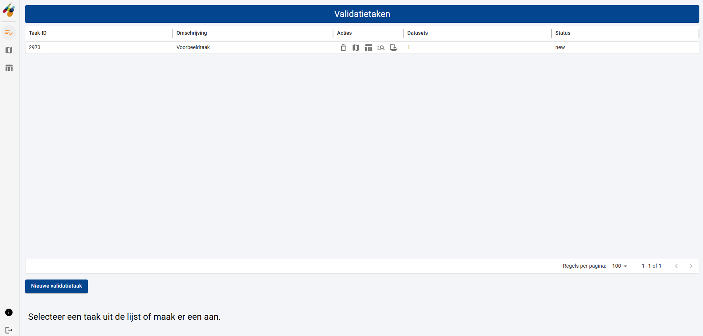
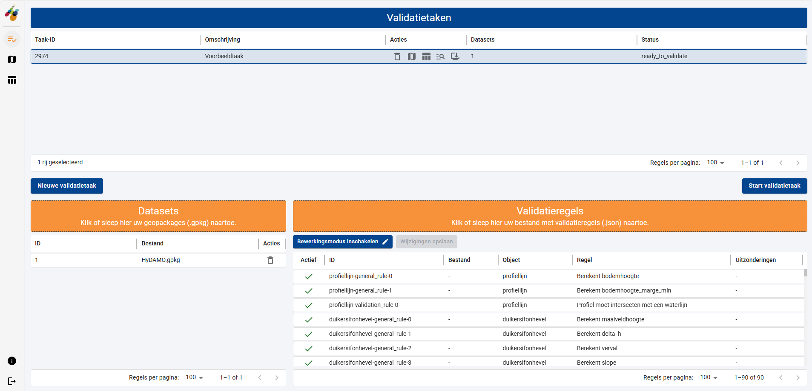
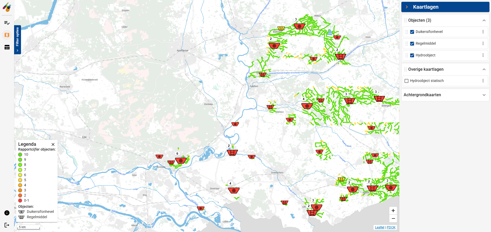
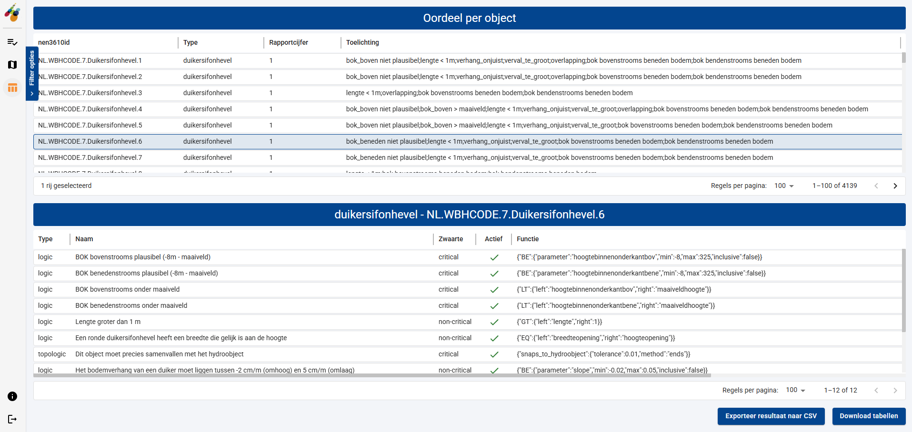
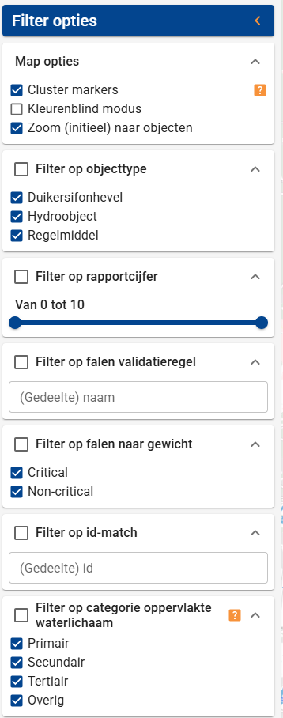
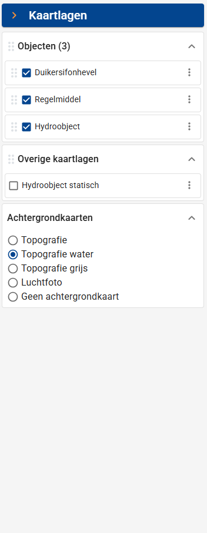

# Opbouw van de schermen

Het scherm van de Webclient bestaat in de basis uit 3 delen:

1. Een verticale menu-balk.
2. Verschillende werkruimtes waarin validatietaken beheerd kunnen worden en resultaten bekeken kunnen worden.
3. Een paneel met filteropties en/of instellingen van achtergrondkaarten (afhankelijk van het gekozen scherm in de menu-balk).

## Menu-balk

De verticale menu-balk bevat 3 items (van boven naar beneden):

1. een item om de werkruimte voor het definiëren van validatietaken te activeren. { width="40" }
   
2. een item om de werkruimte voor het visualiseren van validatie resultaten in een kaart te activeren. { width="40" }

3.  een item om de werkruimte voor het visualiseren van validatie resultaten in een tabel te activeren. { width="40" }

De laatste twee menu-items worden pas actief als er een validatietaak met resultaten beschikbaar is in de tabel met validatie-taken!

## Werkruimte

Er worden 3 soorten werkruimten onderscheiden in de Webclient:

- De werkruimte voor het beheren van validatie-taken.

- De werkruimte voor het bekijken van validatie resultaten op een kaart.

- De werkruimte voor het bekijken van validatie resultaten in een tabel.

## Zijpaneel - filteropties

Aan de linkerzijde is, in de werkruimte voor het bekijken en bewerken van resultaten op de kaart en in een tabel, een uit-/inklapbaar paneel opgenomen met filteropties. Aan de rechterzijde is, alleen in de werkruimte voor het bekijken en bewerken van resultaten op de kaart, een uit-/inklapbaar paneel opgenomen met kaartopties.

|  **Paneel met filteropties**                                                             |  **Paneel met kaart**  **opties**                                                        |
|:-----------------------------------------------------------------------------------------|:-----------------------------------------------------------------------------------------|
| { width="180" } | { width="180" } |

Ga verder naar [Beheren van validatietaken](03%20Beheren%20van%20validatietaken.md).