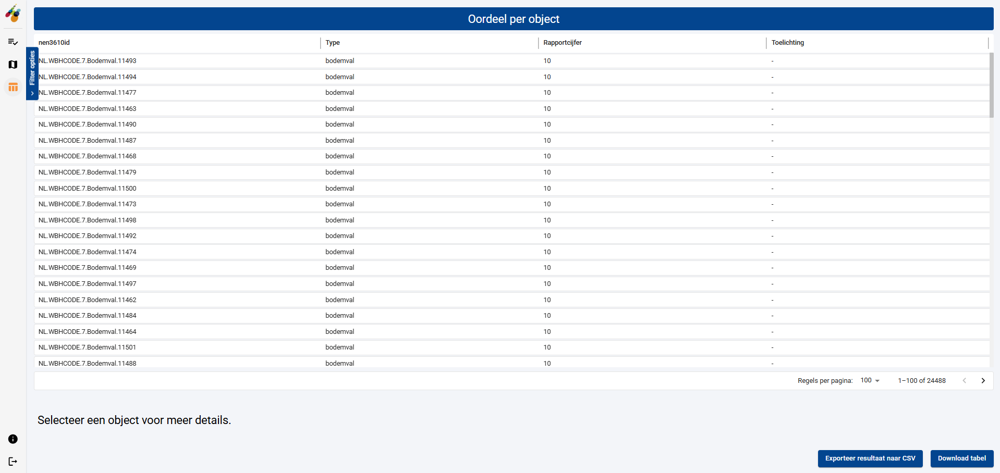
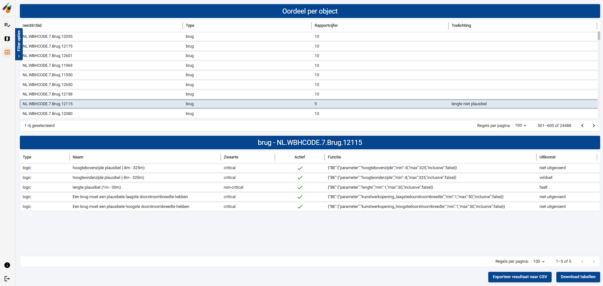

# Bekijken van validatie resultaten in tabel

Activeer de werkruimte voor het bekijken van validatie resultaten in tabelvorm vanuit de werkruimte voor het beheren van validatietaken, door:

- op de icoon  te klikken van de betreffende validatietaak.
- het menu-item  te activeren waarbij de betreffende validatietaak in de tabel met validatatietaken is geselecteerd.

Er verschijnt een tabel met daarin alle objecten uit de verschillende objectlagen die in de validatietaak zijn gevalideerd. Voor elke object is de unieke NEN3610id weergegeven, het type object, het rapportcijfer en een beknopte toelichting op de validatieregels die falen.

Onder de tabel kunt u het aantal regels dat per pagina weergegeven moet worden aanpassen en door de verschillende pagina’s van de tabel navigeren.

U kunt de inhoud van deze tabel downloaden als CSV bestand door de knop 'Download tabel' te activeren.

Om meer detailinformatie van een object te krijgen, selecteert u een rij in de tabel met objecten. Er verschijnt een tweede tabel waarin voor het betreffende object de uitkomsten van de validatieregels wordt getoond.

Hierin zijn voor elke validatieregel opgenomen:

- het type validatieregel.
- de naam van de validatieregel.
- het gewicht van de validatieregel (kritiek of niet-kritiek, respectievelijk ‘critial' of 'non-critical’).
- of de validatieregel actief was.
- de functie van de validatieregel.
- het validatieresultaat (de uitkomst).

Wanneer beide tabellen zichtbaar zijn (objecten en validatieregels) kunt u de inhoud van deze tabellen downloaden door de knop 'Download tabellen' te activeren. Er worden dan twee CSV bestanden met data gedownload (voor elke tabel 1).

Met de knop 'Exporteer resultaat naar CSV' zal altijd alle informatie (voor alle objecten, ongeacht een gemaakte selectie/filter) worden geëxporteerd.

## Filters

De tabel met objecten kan op dezelfde manier als de objecten in de kaart gefilterd worden. Voor een uitgebreide beschrijving van de filters wordt verwezen naar [Bekijken van validatie resultaten op een kaart](04%20Bekijken%20van%20validatie%20resultaten%20op%20een%20kaart.md).
