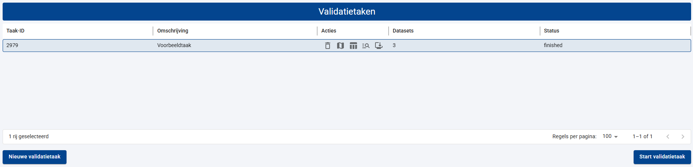
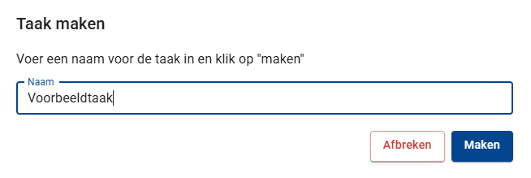
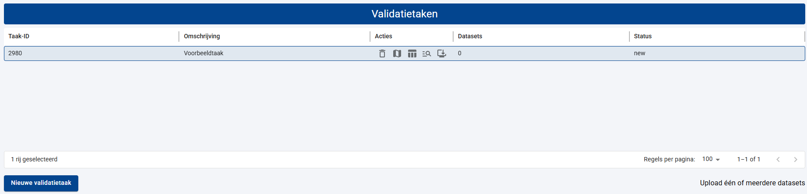
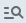

# Nieuwe validatietaak aanmaken

Voordat een dataset gevalideerd kan worden moet eerst een validatietaak gedefinieerd worden. Een validatietaak bestaat uit een unieke ‘id', een willekeurige ‘omschrijving’ van de taak en een ‘status’. Validatietaken worden weergegeven in de tabel 'validatietaken’ in de werkruimte voor het beheren van validatietaken. U ziet hier alleen uw eigen validatietaken, niet die van andere gebruikers!

U kunt een nieuwe validatietaak aanmaken door op de knop ‘nieuwe validatietaak' te klikken. Er verschijnt een dialoog, waarin u een willekeurige omschrijving van de validatietaak kunt opgegeven. Klik op ‘maken’ om de nieuwe validatietaak aan te maken of op 'afbreken’ om deze handeling voortijdig te annuleren.

{width="400"}

Bij het aanmaken van de nieuwe validatietaak, wordt automatisch een uniek ‘id' toegewezen aan uw validatietaak. Elke nieuwe validatietaak krijgt standaard de status 'new’. Deze informatie ziet u terug in de tabel met validatie-taken.

In de tabel is tevens een kolom ‘Datasets' opgenomen. Hierin kunt u zien of en hoeveel dataset bestanden u aan een validatietaak hebt toegevoegd. Tot slot is er een kolom 'Acties’ zichtbaar. Hierin zijn een vijftal knoppen opgenomen:

1. ‘Verwijder deze taak’, waarmee u de validatietaak (inclusief eventuele resultaten definitief verwijderd) uit uw lijst met validatietaken. Taken met een validatieresultaat ouder dan 10 dagen worden door het systeem automatisch verwijderd! 
2. ‘Bekijk resultaten van deze taak op de kaart’, waarmee u de werkruimte voor het bekijken van validatie resultaten op de kaart activeert (zie ook [Resultaten van een validatietaak bekijken](05%20Resultaten%20van%20een%20validatietaak%20bekijken.md)). 
3. ‘Bekijk de resultaten deze taak in tabelvorm’, waarmee u de werkruimte voor het bekijken van validatie resultaten in een tabel activeert (zie ook [Resultaten van een validatietaak bekijken](05%20Resultaten%20van%20een%20validatietaak%20bekijken.md)). 
4. ‘Bekijk de meta-informatie van deze taak’, waarmee u metadata van een uitgevoerd validatietaak kunt opvragen (zie ook [Resultaten van een validatietaak bekijken](05%20Resultaten%20van%20een%20validatietaak%20bekijken.md)). 
5. ‘Download alle metadata en resultaten’(zie ook [Resultaten van een validatietaak bekijken](05%20Resultaten%20van%20een%20validatietaak%20bekijken.md)). 

Een nieuw aangemaakt validatietaak bevat nog geen dataset bestanden of validatieregels. Lees hier hoe u deze kunt toevoegen:

- [Dataset bestanden toevoegen aan een validatietaak](02%20Dataset%20bestanden%20toevoegen%20aan%20een%20validatietaak.md)
- [Validatieregels toevoegen aan een validatietaak](03%20Validatieregels%20toevoegen%20aan%20een%20validatietaak.md)
