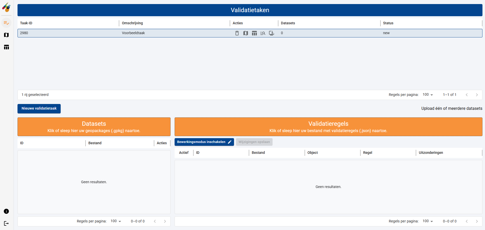
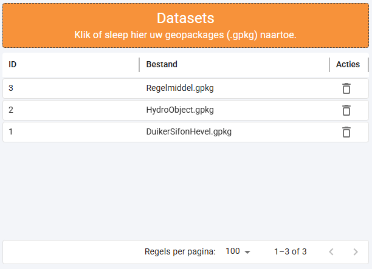
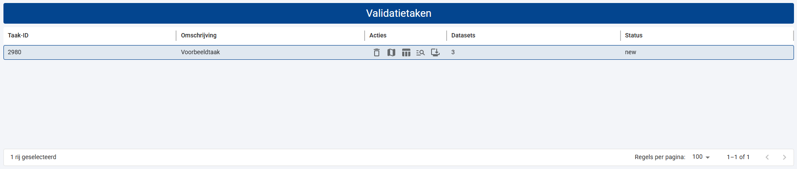
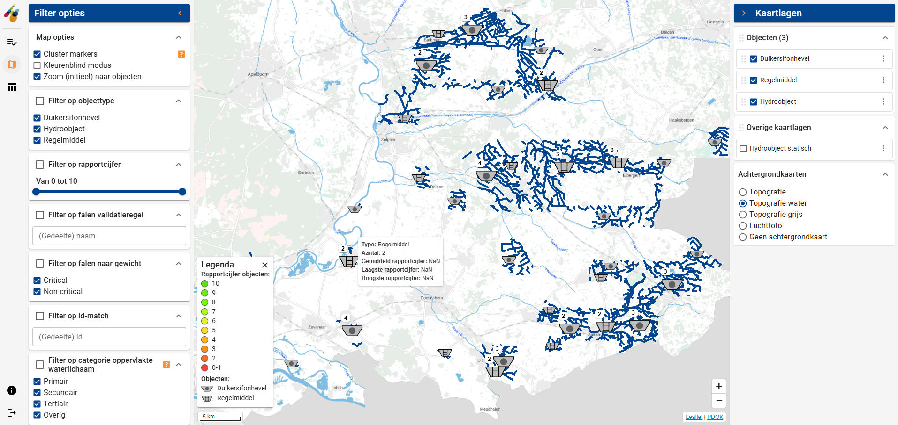

# Dataset bestanden toevoegen aan een validatietaak

Het doel van de HyDAMO Validatietool is het valideren van datasets. Deze datasets kunnen afkomstig zijn van registers van Waterschappen, of uit het GKW (GegevensKnooppunt Waterschappen) of uit het NHI portaal. Datasets die worden toegevoegd aan de HyDAMO Validatiemodule moet voldoen aan twee voorwaarden:

- de data moet voldoen aan het DAMO datamodel. Zie voor meer informatie https://damo.hetwaterschapshuis.nl/.
- de data is van het (open data) formaat Geopackage (extensie \*.gpkg). Zie voor meer informatie [Geopackage](https://www.geopackage.org/).

Om een dataset toe te voegen selecteert u eerst een validatietaak in de tabel met validatietaken.

U kunt nu op twee manieren een dataset toevoegen aan de geselecteerde validatietaak:

1. Klik ergens in het oranje vlak van de ‘Datasets’. Er wordt een bestandsdialoog geopend waarin u een Geopackage databestand kunt selecteren.
2. Selecteer een Geopackage databestand (bijvoorbeeld in de Windows Verkenner) en sleep deze op het oranje vlak van de ‘Datasets’.

Zodra de databestanden zijn toegevoegd verschijnen deze in de tabel met datasets.

{width="500"}

U kunt een per ongeluk verkeerd toegevoegd databestand verwijderen door de prullenbak icoon achter de dataset te activeren.

Merk op dat na het toevoegen van 1 of meerdere dataset bestanden, het aantal datasets in de tabel met validatietaken wordt bijgewerkt. De status van de validatietaak is na het toevoegen van datasets nog ongewijzigd. Pas als er zowel datasets als validatieregels aan een validatietaak zijn toegevoegd zal de status gewijzigd worden.

Nieuw is de mogelijkheid om de ingelezen data (voordat een validatietaak is gestart) alvast te beoordelen op een kaart. Activeer hiervoor de menuknop ‘Validatieresultaten op kaart’ in de verticale menu-balk of de knop ‘Bekijk resultaten van deze taak op de kaart' in de kolom 'Acties’ van de betreffende taak in de tabel met validatietaken.

De legenda duidt de verschillende iconen (afhankelijk van de beschikbare objecten in de databestanden). Hydro-objecten (oftewel de waterlichamen/watergangen) worden als lijnen weergegeven en zijn op genomen in de legenda. De kleuren uit de legenda zijn pas van toepassing als een validatieresultaat beschikbaar is.

Het paneel met de kaartopties (rechterzijde van het scherm) bevat voor elk type object uit de databestanden een aparte kaartlaag. Elke kaartlaag kan van de kaart verwijderd worden door het vinkje van de betreffende kaartlaag weg te halen. Daarnaast is er een sectie met 'Overige kaartlagen'. Hier wordt altijd een referentie kaartlaag van de waterlichamen/watergangen getoond en eventuele andere objecten waarvan geen geografische ligging bekend is. Tot slot is er een sectie waarin van achtergrondkaartlaag kan worden gewisseld.

Het paneel met de filteropties (linkerzijde van het scherm) bevat allerlei filter mogelijkheden. Een groot deel van deze filteropties is op basis van validatieresultaten en dus alleen relevant als de validatietaak al is uitgevoerd (zie ook [Bekijken van validatie resultaten op een kaart](../04%20Bekijken%20van%20validatie%20resultaten%20op%20een%20kaart.md)).

De volgende stap is het toevoegen van een Json bestand met validatieregels (zie [Validatieregels toevoegen aan een validatietaak](03%20Validatieregels%20toevoegen%20aan%20een%20validatietaak.md)).
